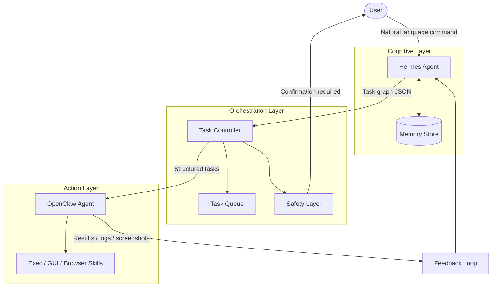

# System Architecture

Component layout and data flow for HermesClaw.

## Overview

Three roles:

- **Hermes** — planning (JSON output only)
- **OpenClaw** — execution (validated plans only)
- **Task Controller** — orchestration, retries, audit

Planning and execution are separate so validation can sit between them. See [security-architecture.md](security-architecture.md) and [SECURITY.md](../SECURITY.md).

---

## Security Pipeline (Trust Boundary)

Every plan from Hermes passes through this pipeline before OpenClaw executes anything:

```
User Intent
     │
     ▼
Hermes Adapter ─── JSON plans only; rejects raw executable code
     │
     ▼
PlanValidator ─── schema check, forbidden fields, path guard, command policy
     │
     ▼
PermissionGateway ─── user confirmation for high-risk / exec actions
     │
     ▼
OpenClaw Adapter ─── sandboxed execution, dry-run, timeout
     │
     ▼
Feedback Engine ─── COMPLETE | RETRY | REPLAN | ASK_USER
     │
     └──► Hermes Replan (with structured failure context, no raw code)
```

| Module | File | Purpose |
|--------|------|---------|
| `HermesAdapter` | `hermes/adapter.py` | Planner — JSON only, rejects raw code |
| `PlanValidator` | `security/plan_validator.py` | Never trust LLM output |
| `PermissionGateway` | `security/permission_gateway.py` | Validation + user approval |
| `OpenClawAdapter` | `openclaw/adapter.py` | Sandboxed execution |
| `FeedbackEngine` | `feedback/engine.py` | Replan / retry decisions |
| `AgentPipeline` | `controller/pipeline.py` | End-to-end orchestration |
| `PathGuard` | `security/path_guard.py` | Filesystem boundaries |
| `CommandPolicy` | `security/command_policy.py` | Allowlisted commands only |
| `AuditLogger` | `security/audit.py` | Full action audit trail |

---

## Component Diagram



---

## Agent Responsibilities

### Hermes (Planner / Cognitive Agent)

| Capability | Description |
|------------|-------------|
| Intent parsing | Converts natural language into structured goals |
| Task decomposition | Breaks goals into ordered, executable steps |
| Error analysis | Interprets failure reports and decides next action |
| Decision making | Retry, alternate path, or escalate to user |
| Memory | Persists workflows, preferences, and past attempts |

**Output format:** JSON task graph sent to the Task Controller.

### OpenClaw (Executor / Action Agent)

| Capability | Description |
|------------|-------------|
| Shell execution | Runs terminal commands via the exec tool |
| File operations | Read, write, move, organize files |
| GUI automation | Mouse, keyboard, and vision-based UI control |
| App launching | Opens applications and workspaces |
| Browser control | Web automation via OpenClaw browser skills |

**Output format:** Structured execution report (status, logs, optional screenshot path).

### Task Controller (Bridge)

| Capability | Description |
|------------|-------------|
| Task queue | FIFO / priority queue for pending steps |
| Routing | Sends tasks to OpenClaw in order |
| Safety gating | Blocks destructive ops until user confirms |
| State tracking | Maintains workflow state across steps |
| Agent coordination | Manages message passing between Hermes and OpenClaw |

---

## Data Flow

### 1. Planning Phase

```
User: "Organize downloads and open Chrome"
         │
         ▼
Hermes analyzes intent + memory context
         │
         ▼
Produces task graph:
  1. list_files(~/Downloads)
  2. create_folders(Images, Documents, ...)
  3. move_files_by_type(...)
  4. launch_app(chrome)
         │
         ▼
Controller validates + enqueues tasks
```

### 2. Execution Phase

```
Controller dequeues task #1
         │
         ▼
OpenClaw executes via appropriate skill/tool
         │
         ▼
Returns: { "status": "success", "output": "..." }
         │
         ▼
Controller marks task complete, dequeues #2
```

### 3. Feedback Phase

```
All tasks complete (or one fails)
         │
         ▼
Controller sends summary to Hermes
         │
         ▼
Hermes validates against original intent
         │
         ├── Success → report to user
         ├── Partial failure → retry or replan
         └── Ambiguous → ask user
```

---

## Task Graph Schema

```json
{
  "workflow_id": "uuid",
  "user_intent": "original natural language command",
  "tasks": [
    {
      "id": "task-1",
      "action": "create_folders",
      "params": { "paths": ["~/Projects/src", "~/Projects/data"] },
      "requires_confirmation": false,
      "depends_on": []
    },
    {
      "id": "task-2",
      "action": "exec",
      "params": { "command": "rm -rf ~/temp/*" },
      "requires_confirmation": true,
      "depends_on": ["task-1"]
    }
  ]
}
```

---

## Safety Layer

Operations flagged as high-risk require explicit user confirmation before OpenClaw executes them:

| Category | Examples | Default |
|----------|----------|---------|
| Destructive file ops | `rm`, `del`, overwrite | Confirm |
| Shell execution | Arbitrary terminal commands | Confirm |
| Network requests | External API calls | Allow |
| App installation | Package managers | Confirm |

Configuration via `SAFETY_CONFIRM_DESTRUCTIVE` in `.env`.

---

## Memory Model

| Store | Technology | Contents |
|-------|------------|----------|
| Workflow history | SQLite | Past task graphs and outcomes |
| User preferences | SQLite / Hermes memory | Preferred apps, paths, formats |
| Semantic recall | ChromaDB (optional) | Embeddings of past workflows for similarity search |

Hermes maintains its own skill memory in `~/.hermes/skills/`. This project adds a workflow-level memory layer in `./data/`.

---

## Integration Points

### Hermes API

The bridge invokes Hermes for planning via:

- CLI: `hermes -z "plan: {user_command}"` (one-shot mode)
- Library: Python wrapper in `src/hermes_openclaw/hermes/`

### OpenClaw API

The bridge sends tasks to OpenClaw via:

- Gateway WebSocket/HTTP API
- Exec tool for shell commands
- Skills for GUI and browser automation

See [OpenClaw Gateway docs](https://docs.openclaw.ai/gateway) for endpoint details.

---

## Future Extensions

| Agent | Role |
|-------|------|
| Browser Agent | Dedicated web scraping and form automation |
| Vision Agent | Screenshot analysis and UI element detection |
| Code Agent | Repository-aware code generation and review |
| Voice Agent | Speech-to-text input and TTS responses |

These would plug into the Task Controller as additional executors, with Hermes remaining the central planner.

---

## Performance Considerations

| Metric | Target | Notes |
|--------|--------|-------|
| Planning latency | < 5s | Depends on local LLM model size |
| Task execution | Variable | Dominated by desktop action time |
| Feedback loop overhead | < 1s | JSON parsing + queue management |
| Offline capability | Full | Requires local Ollama + local agents |

---

## References

- [Hermes Agent — Nous Research](https://github.com/NousResearch/hermes-agent)
- [OpenClaw Documentation](https://docs.openclaw.ai/)
- [LangGraph — Multi-agent orchestration](https://langchain-ai.github.io/langgraph/)
- [CrewAI — Multi-agent framework](https://docs.crewai.com/)
